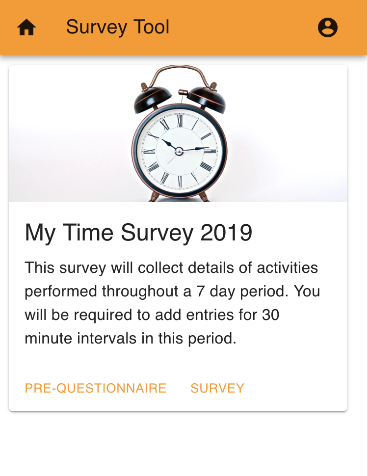
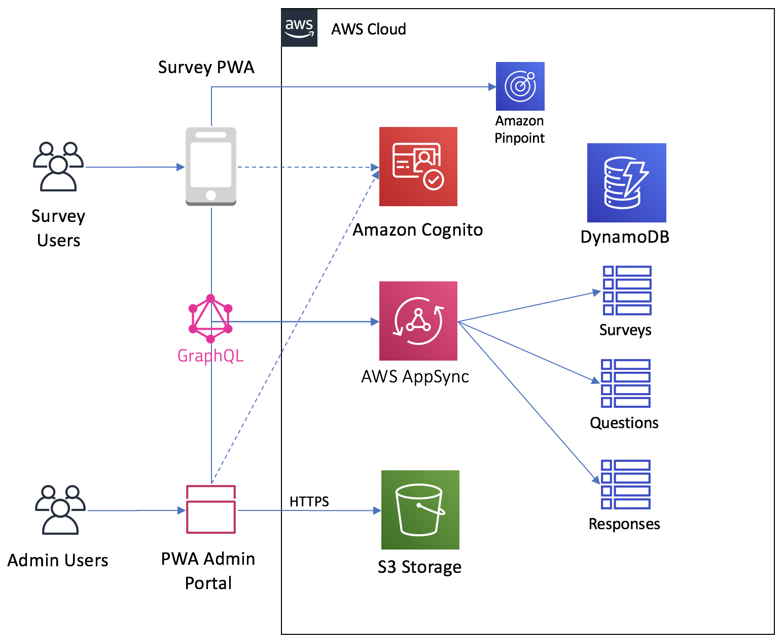

# AWS Appsync Survey Tool

Sample Survey Tool Progressive Web Application written with React, GraphQL, AWS AppSync & AWS Amplify

[](https://console.aws.amazon.com/amplify/home#/deploy?repo=https://github.com/aws-samples/aws-appsync-survey-tool)




## Features

- Full Progressive Web Application (PWA)
- Install (desktop) or Add to Homescreen (mobile)
- Offline ready
- Adminstration Portal
- User management


## Technologies

- AWS AppSync
- AWS Amplify
- GraphQL
- React Router
- React Apollo
- Material UI

---

## Quicklinks

- [Introduction](#introduction)
- [Getting Started](#getting-started)
  - [Prerequisites](#prerequisites)
  - [Automated Setup](#automated-setup)
  - [Manual Setup](#manual-setup)
- [Clean Up](#clean-up)

---

## Introduction

This is a demonstration solution that uses AWS AppSync to implement a survey app as a [Progressive Web Application](https://developers.google.com/web/progressive-web-apps/) (PWA). In this app, users can complete assigned surveys, including pre and post questionnaires. The solution also includes an administration portal, which allows admins to create and manage surveys and questionnaires. The solution demonstrates GraphQL capabilities (e.g. Mutations, Queries and Subscriptions) with AWS AppSync, offline support with the AWS AppSync SDK and React Apollo, and integrates with other AWS Services such as:
- Amazon Cognito for user management, as well as Auth N/Z
- Amazon DynamoDB with NoSQL Data Sources
- Amazon S3 for asset storage
- Amazon Pinpoint for web client analytics data collection



## Getting Started

### Prerequisites

- [AWS Account](https://aws.amazon.com/) with appropriate permissions to create the related resources
- [NodeJS](https://nodejs.org/en/download/) with [NPM](https://docs.npmjs.com/getting-started/installing-node)
- [AWS CLI](http://docs.aws.amazon.com/cli/latest/userguide/installing.html) with output configured as JSON `(pip install awscli --upgrade --user)`
- [AWS Amplify CLI](https://github.com/aws-amplify/amplify-cli) configured for a region where [AWS AppSync](https://docs.aws.amazon.com/general/latest/gr/rande.html) and all other services in use are available `(npm install -g @aws-amplify/cli)`
- [Create React App](https://github.com/facebook/create-react-app) `(npm install -g create-react-app)`


### Automated Setup

***_This process will use the configuration in the amplify folder of this repo._***

1. First, clone this repository and navigate to the created folder:

   ```bash
   git clone https://github.com/aws-samples/aws-appsync-survey-tool.git

   cd aws-appsync-survey-tool
   ```

2. Install the required modules:

   ```bash
   npm install
   ```

3. Initilize the directory as an Amplify **Javascript** app using the **React** framework:

   ```bash
   amplify init
   ```

4. Now it's time to provision your cloud resources based on the local setup and configured features. When asked to generate code, answer **"NO"** as it would overwrite the current custom files in the `src/graphql` folder.

   ```bash
   amplify push
   ```

   Wait for the provisioning to complete. Once done, a `src/aws-exports.js` file with the resources information is created.

5. Run the project locally:

   ```bash
   npm start
   ```
---

### Manual Setup

***_This process lets you configure custom settings for your backend components._***

1. First, clone this repository and navigate to the created folder:

   ```bash
   git clone https://github.com/aws-samples/aws-appsync-survey-tool.git

   cd aws-appsync-survey-tool
   ```

2. Install the required modules:

   ```bash
   npm install
   ```

3. Delete the amplify folder

   ```bash
   rm -f amplify
   ```

4. Init the directory as an amplify **Javascript** app using the **React** framework:

   ```bash
   amplify init
   ```

5. Add an **Amazon Cognito User Pool** auth resource. Use the default configuration.

   ```bash
   amplify add auth
   ```

6. Add an **AppSync GraphQL** API with **Amazon Cognito User Pool** for the API Authentication. Follow the default options. When prompted with "_Do you have an annotated GraphQL schema?_", select **"YES"** and provide the schema file path `backend/schema.graphql`

   ```bash
   amplify add api
   ```

7. Now it's time to provision your cloud resources based on the local setup and configured features. When asked to generate code, answer **"NO"** as it would overwrite the current custom files in the `src/graphql` folder.

   ```bash
   amplify push
   ```

   Wait for the provisioning to complete. Once done, a `src/aws-exports.js` file with the resources information is created.

8. Run the project locally:

   ```bash
   npm start
   ```

---

### Clean Up

To clean up the project use:

```bash
amplify delete
```

to delete the resources created by the Amplify CLI.

---

## Change Log

**1.0.0:**
* Initial release.

---

## License

This library is licensed under the Apache 2.0 License. 